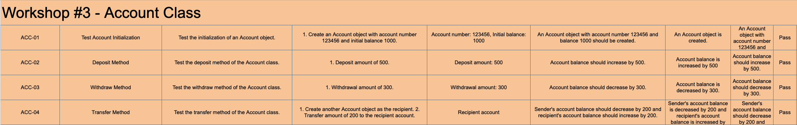
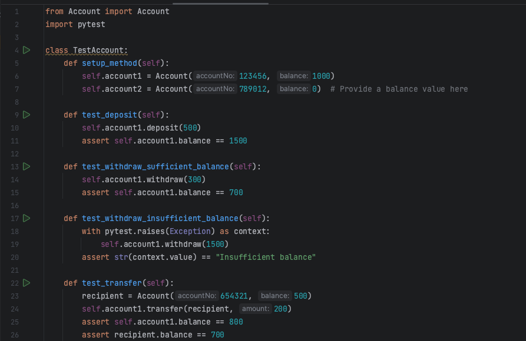
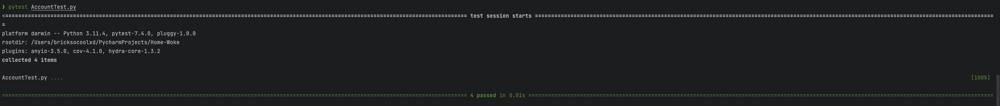
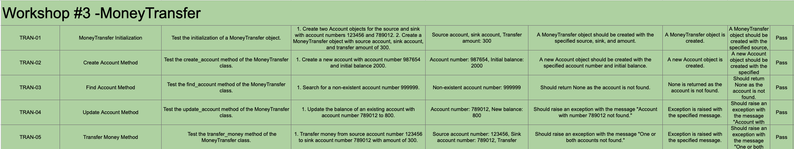
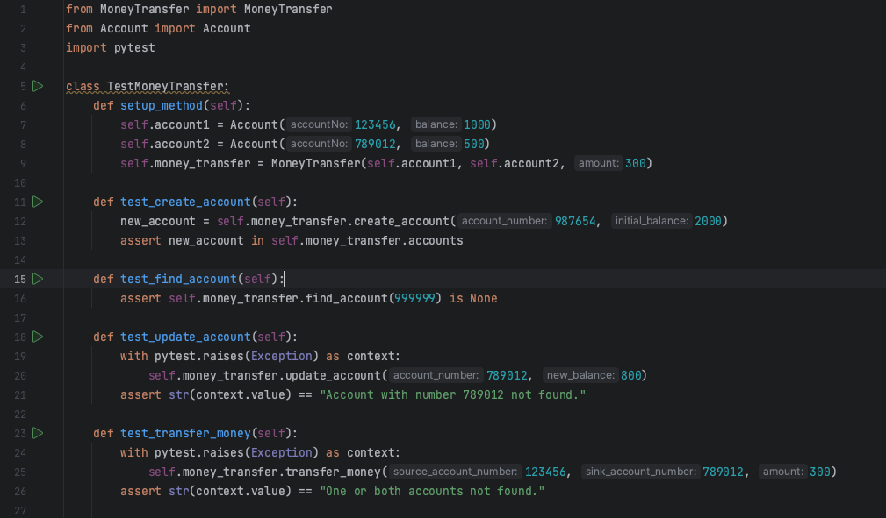

# Workshop created by 6531503042 Nimit Tanboontor
 
### Introduction
This repository contains code for three classes (Account, MoneyTransfer, and MoneyTransferTestCase) that are used for software testing purposes in the unit test workshop. The code was authored and created by Nimit Tanboontor (6531503042).

### Test-case-Documents
1. Account --> AccountTest
Document --> 
Code --> 
Pytest-Output --> 

2. MoneyTransfer --> MoneyTransferTest
Document --> 
Code --> 
Pytest-Output --> 

References
Test-Cases Document --> https://docs.google.com/spreadsheets/d/1cg22JAA6bYvOokmR3WPFF_SVekEraIaIZ2LjdHC2HZs/edit?usp=sharing

### Usage
1. Clone the repository: `git clone https://github.com/<your-username>/unit-test-workshop.git`
2. Run the unit tests: `python -m unittest MoneyTransferTestCase`

### Test Cases
1. Account Initialization: Test the initialization of an Account object.
2. Deposit Method: Test the deposit method of the Account class.
3. Withdraw Method: Test the withdraw method of the Account class.
4. Transfer Method: Test the transfer method of the Account class.
5. MoneyTransfer Initialization: Test the initialization of a MoneyTransfer object.
6. Create Account Method: Test the create_account method of the MoneyTransfer class.
7. Find Account Method: Test the find_account method of the MoneyTransfer class.
8. Update Account Method: Test the update_account method of the MoneyTransfer class.
9. Transfer Money Method: Test the transfer_money method of the MoneyTransfer class.

### Contributors
- Nimit Tanboontor (6531503042)

### License
This project is licensed under the MIT License - see the LICENSE file for details.
