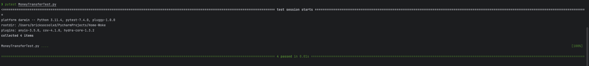

# Workshop created by 6531503042 Nimit Tanboontor
 
### Introduction
This repository contains code for three classes (Account, MoneyTransfer, and MoneyTransferTestCase) that are used for software testing purposes in the unit test workshop. The code was authored and created by Nimit Tanboontor (6531503042).

### Test-case-Documents
1. Account --> AccountTest
Document --> 
Code --> 
Pytest-Output --> 

2. MoneyTransfer --> MoneyTransferTest
Document --> 
Code --> 
Pytest-Output --> 

References
Test-Cases Document --> https://docs.google.com/spreadsheets/d/1cg22JAA6bYvOokmR3WPFF_SVekEraIaIZ2LjdHC2HZs/edit?usp=sharing

### Usage
1. Clone the repository: `git clone https://github.com/<your-username>/unit-test-workshop.git`
2. Run the unit tests: `python -m unittest MoneyTransferTestCase`

### Test Cases
1. Test Account Initialization: Checks if the Account class initializes with the correct account number and balance.
2. Test Deposit Method: Tests the deposit functionality of the Account class.
3. Test Withdraw Method with Sufficient Balance: Tests the withdraw method when the account has sufficient balance.
4. Test Withdraw Method with Insufficient Balance: Tests the withdraw method when the account has insufficient balance.
5. Test Transfer Method: Tests the transfer method of the Account class.

6. Test MoneyTransfer Initialization: Checks if the MoneyTransfer class initializes with the correct source, sink, and amount.
7. Test Create Account Method: Tests the creation of a new account.
8. Test Find Account Method: Tests finding an account by account number.
9. Test Update Account Method: Tests updating the balance of an account.
10. Test Transfer Money Method: Tests transferring money between accounts.

### Contributors
- Nimit Tanboontor (6531503042)

### License
This project is licensed under the MIT License - see the LICENSE file for details.
